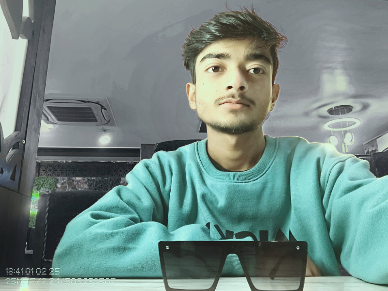

<div align="center">

<!-- Animated Banner -->


<!-- Badges Row -->
<p>
  
  
  
  
</p>

<!-- Profile Views -->


</div>

---

## 🌐 Live Demo

<div align="center">

[](https://laukesh.onrender.com/)

</div>

---

## 🖼️ Preview

<div align="center">

</div>

---

## ✨ About The Project

> A visually stunning **personal portfolio** for **Laukesh Kumar** — a talented **Photo Editor** and passionate **BGMI Gamer**. The site showcases his editing work, gaming highlights, services, and contact info — all wrapped in a smooth, animated UI.

---

## 🚀 Features

| Feature | Description |
|---|---|
| 🎨 **Animated Background** | Gradient orbs with smooth floating animation |
| 📊 **Scroll Progress Bar** | Real-time reading progress indicator |
| 🌓 **Dark / Light Theme** | One-click theme toggle with persistence |
| 📱 **Fully Responsive** | Mobile-first design with hamburger menu |
| ⌨️ **Typing Animation** | Dynamic text in the hero section |
| 🖼️ **Filterable Portfolio** | Photo edits with lightbox & category filter |
| 🎮 **Gaming Section** | YouTube highlights, stream links & schedule |
| 💰 **Pricing Cards** | Transparent service packages |
| 📬 **Contact Form** | Direct Email / WhatsApp / Social integration |
| ♿ **Accessibility** | Focus styles & semantic HTML throughout |

---

## 🛠️ Tech Stack

<div align="center">


</div>

---

## 📂 Project Structure

```
laukeshKumar-Profile/
│
├── 📄 index.html                        # Main HTML entry point
├── 🎨 style.css                         # All styles, animations & responsive design
├── ⚡ script.js                          # Interactivity (lightbox, theme toggle, scroll)
│
├── 🖼️ laukesh.jpeg                      # Profile image
├── 🖼️ portfolio.png                     # Portfolio sample
├── 🎮 BGMI.webp                         # Gaming section thumbnail
├── 🌄 Landscape.jpg                     # Landscape photo edit
├── 🌌 luminous-metaverse-background.jpg # Cinematic gamer background
│
└── 📋 manifest.json                     # PWA manifest
```

---

## ⚙️ Getting Started

### Prerequisites
- Any modern web browser (Chrome, Firefox, Edge)
- No build tools or dependencies required!

### Installation

```bash
# 1. Clone the repository
git clone https://github.com/eddiebrock911/laukeshKumar-Profile.git

# 2. Navigate into the project
cd laukeshKumar-Profile

# 3. Open in browser
open index.html
# or just double-click index.html
```

### Customization

```bash
# Replace profile image
laukesh.jpeg → your-photo.jpeg

# Update social links in index.html
Instagram / Twitch / YouTube / WhatsApp

# Modify services & pricing
Search for "pricing" section in index.html

# Change theme colors
Edit CSS variables in style.css :root {}
```

---

## 📸 Sections Overview

```
Hero ──► About ──► Portfolio ──► Gaming ──► Services ──► Contact ──► Footer
```

- **Hero** — Profile photo, animated intro, CTA buttons
- **About** — Skill bars, stats counter, "Why Choose Me" highlights
- **Portfolio** — Filterable edits with hover effects & lightbox
- **Gaming** — BGMI YouTube clips, stream schedule, Twitch/YT links
- **Services** — Photo editing packages with transparent pricing
- **Contact** — Form + WhatsApp + Email + Social media links

---

## 👥 Team

<div align="center">

| Role | Name | Contact |
|------|------|---------|
| 🎨 Portfolio Owner | **Laukesh Kumar** | *(Add your links)* |
| 💻 Developer | **Ankit Kumar** | [](https://www.instagram.com/__ankit._.op_/) |

</div>

---

## 📊 Repo Stats

<div align="center">


</div>

---

## 📜 License

This project is free to use and customize for **personal portfolio purposes**.  
Attribution appreciated but not required. 🙌

---

<div align="center">


**Made with ❤️ by [Ankit Kumar](https://www.instagram.com/__ankit._.op_/) for Laukesh Kumar**

*⭐ Star this repo if you liked it!*

</div>
